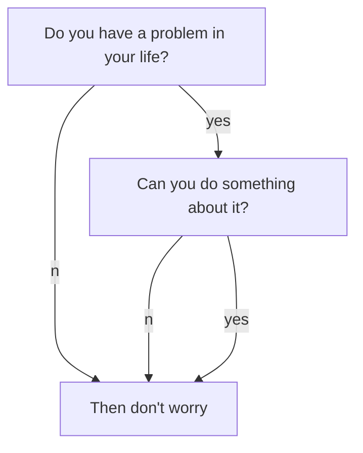

* content
{:toc}


---


```python

```


---

# TEST

```python
# 주석
'''
여러 줄 주석
'''
print("Hello World")
def add(3, 4):
    return 3 + 4
```

```c
#include <stdio.h>

int main(void) {
    int a;
    printf("%d\n", a);
    printf("Hello world\n");
    return 0;
}
```

==Python==

# 결론

 알고리즘만으로 해결할 수 없는 다른 영역으로는 난수 생성을 예로 들 수 있다. 시스템 시간을 사용해 시드(Seed)를 생성하는 방법이 있지만, 이러한 방법으로 난수를 생성하는 것은 유추가 가능하기에 완전하다고 볼 수 없다. 그렇기 때문에 컴퓨터가 생성한 난수를 의사 난수라고 부른다. 그러나 인간이 생각하는 무작위 수는 예측할 수 없다. 학창 시절, 칠판의 문제를 풀어볼 학생의 학번을 정하는 선생님의 '난수 생성'은 어떠한 알고리즘으로도 예측할 수 없다. [^1]

 machine_H를 만드는 것은 어쩌면 가능하지 않을까? 알파고가 그랬던 것처럼, machine_H를 수많은 데이터와 이를 기반으로 한 학습을 바탕으로 구현한다면 어떤 알고리즘의 청사진이든(심지어 자기 자신까지도) 결과를 예상할 것처럼 보인다. 그러나 이 상상은 모순이라는 벽에 부딪힌다. machine_X에 machine_H의 청사진을 입력하면, 그 안의 machine_H는 항상 잘못된 값을 가정하는 무한 루프에 빠지게 된다. machine_H의 무한 루프를 검토하는 다른 알고리즘을 만든다고 해도, 그 알고리즘이 정확히 판별할 수 없는 함수가 적어도 하나 존재하게 된다.

 인간의 사고 또한 무한 루프에 가로막혀 답을 낼 수 없는 경우가 존재한다. 단적인 예시로 '창조주의 창조주는 누구인가?'라는 물음은 꼬리에 꼬리를 물고 이어진다. 사람들은 이에 대해 저마다의 답을 내놓는다. 그렇지만 정지 문제를 해결할 수 있는 알고리즘이 없듯이, 이 물음에 대해 논리적 증명을 할 수 있는 사람은 없다. 사람과 컴퓨터가 미제를 공유한다는 점이 어쩌면 프로그래밍에 끌리는 이유일지도 모른다.

 

## 1. 각주

[^1]: 최근 들어서 난수 생성의 난관은 양자 난수 등의 기술을 적용한 하드웨어와의 결합으로 극복되고 있다. 


```flow
st=>start
op=>operation: Your Operation
cond=>condition: Yes or No?
e=>end

st->op->cond
cond(yes)->e
cond(no)->op
```



% highlight <python> linenos %}

```python
def bubble_sort(arr):
    n = len(arr)
    for i in range(n-1):
        for j in range(n-1, i, -1):
            if arr[j-1] > arr[j]:
                arr[j-1], arr[j] = arr[j], arr[j-1]
```

 
