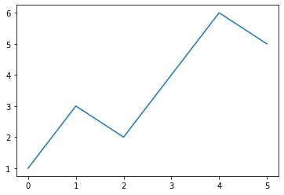
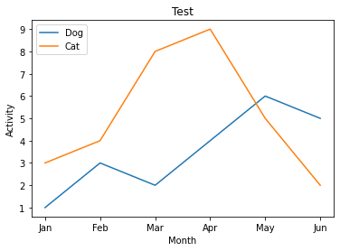
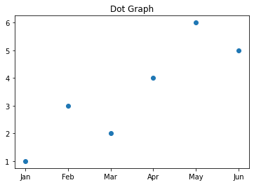
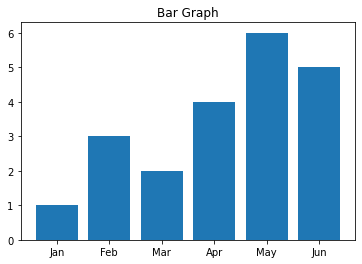

Matplotlib 라이브러리는 파이썬 그래프를 표시하며, 다른 데이터 분석 라이브러리인 `Numpy`, `Pandas`와 연계가 가능하다.

사용하기 앞서 다음과 같이 모듈을 가져온다.


```python
import matplotlib.pyplot as plt
```

# 막대 그래프


```python
a = [1, 3, 2, 4, 6, 5]
plt.plot(a)
plt.show()
```


​    

​    


```python
X = ["Jan", "Feb", "Mar", "Apr", "May", "Jun"]
Y1 = [1, 3, 2, 4, 6, 5]
Y2 = [3, 4, 8, 9, 5, 2]

plt.plot(X, Y1, label="Dog")
plt.plot(X, Y2, label="Cat")

plt.xlabel("Month")
plt.ylabel("Activity")

plt.title("Test")
plt.legend(loc="upper left")

plt.show()
```


​    

​    


데이터에 `label`을 붙이고, `legend`로 표시한다.

각 축에 해당하는 값에 `xlabel` `ylabel`을 사용해 이름을 붙인다.

`title`에 제목을 입력한다.

# 다양한 그래프
마커의 종류 ( `*`, `.`, `D`, `v` )를 지정해 점 그래프를 그릴 수 있다. 


```python
plt.plot(X, Y1, "o")
plt.title("Dot Graph")
plt.show()
```


​    

​    


plot 대신 `bar`을 사용해 막대 그래프를 그릴 수 있다.


```python
plt.bar(X, Y1)
plt.title("Bar Graph")
plt.show()
```


​    

​    

